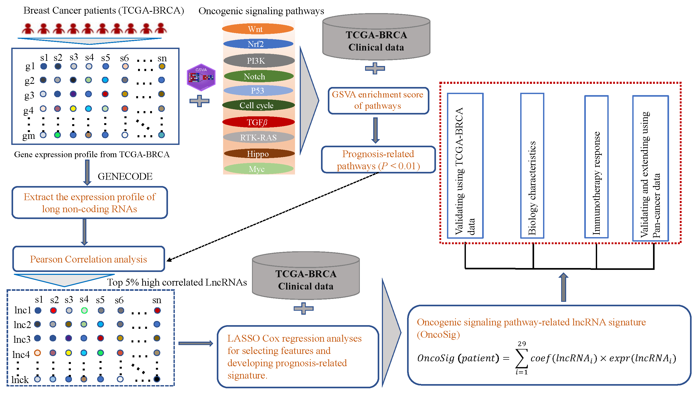

# OncoSig
Oncogenic Signaling Pathway-Related Long Non-coding RNAs for Predicting Prognosis and Immunotherapy Response in Breast Cancer


# Download TCGA RNA-seq data and clinical data for analyzing.
``` r
library(dplyr)
library(Seurat)
library(maftools)
library(TCGAbiolinks)
library(SummarizedExperiment)

setwd('../0.data')

#----------------------------------------------------------------
# Download Pan cancer data from TCGA database

proj.ids <- getGDCprojects()$id %>% grep('TCGA', .,  v = T)

for (proj in proj.ids) {
    query <-GDCquery(
            project = proj,
            experimental.strategy = 'RNA-Seq',
            data.category = "Transcriptome Profiling",
            data.type = "Gene Expression Quantification",
            workflow.type = "HTSeq - FPKM",
            legacy = FALSE
    )
    GDCdownload(query)
    data <- GDCprepare(query)
    TCGA.data <- assay(data)
    anno.table <- read.table('gencode.gene.info.v22.tsv', sep = '\t', header = TRUE)
    anno.table$gene_id <- gsub('\\..*', '', anno.table$gene_id)
    idxes <- which(anno.table$gene_id %in% rownames(TCGA.data))
    anno.table.sub <- anno.table[idxes, ] %>% .[!duplicated(.$gene_id), ] %>% .[!duplicated(.$gene_name), ]
    anno.table.sub <- subset(anno.table.sub,  gene_status == 'KNOWN' & gene_type == 'protein_coding')

    TCGA.data <- TCGA.data[anno.table.sub$gene_id, ]
    rownames(TCGA.data) <- anno.table.sub$gene_name

    obj <- CreateSeuratObject(counts = TCGA.data, meta.data = colData(data) %>% as.data.frame, project = proj)
    saveRDS(obj, file = sprintf('%s-Obj.rds', proj))
}

print('Okay!')

```
